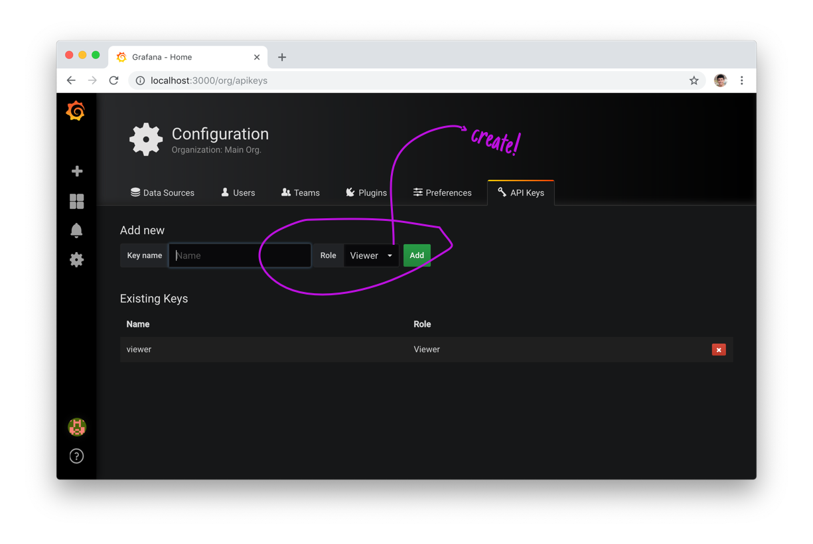

### grafana-sync - Keeps your Grafana dashboards in sync

At each time that it's run, `grafana-sync` gathers information about dashboards from a particular source of truth (a grafana deployment) and then updates the state of the filesystem to reflect such source.

ps.: assumes use of the `folders` feature from grafana 5+

### Usage

```
Usage:
  grafana-sync [OPTIONS]

Application Options:
      --access-token= access token to authenticate against grafana
      --address=      grafana address (default: http://localhost:3000)
      --directory=    directory where dashboards live (default: ./)
  -v, --verbose       displays requests on stderr

Help Options:
  -h, --help          Show this help message

```

1. Create an API key that is capable of visualizing all dashboards



2. Run `grafana-sync`

```sh
./grafana-sync \
    --verbose \
    --address http://my-instance.com \
    --access-token=<api_key> \
    --directory=./dashboards
```

